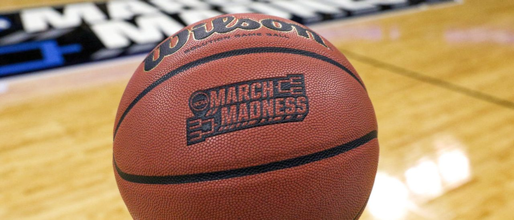
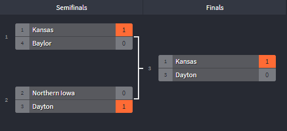

## Predicting NCAA Basketball Tournament Success with Machine Learning Models

  

* [Full Project Report](#)
### Abstract
In this paper, we attempt to predict the success of teams participating in the 2015-2019 NCAA Men's Basketball Tournaments using Machine Learning algorithms and find which statistical features give the highest likelihood for games won. By training our data on multiple regression models, we find the best model to be Lasso Regression. We also find that that Adjusted Defensive Efficiency has the largest impact on how far a team makes it in the tournament. Using our test results, we predict Kansas as the winner of the 2020 NCAA Tournament that had been canceled due to COVID-19.

### The Data
We used the [College Basketball Dataset by Andrew Sundberg](https://www.kaggle.com/andrewsundberg/college-basketball-dataset) for our predictions of the 2015-2020 seasons.

### Results
We found Lasso Regression to be the most accurate regression model for predicting the champion. The most important feature that contributed to how far a team goes in the tournament was Adjusted Defensive Efficiency.

### 2020 Final Four Prediction
We then used our model to predict the winner of the 2020 tournament if it were to happen given this season's stats.

  

### Authors
* [Akash Krishna](https://github.com/AkashK23)
* [Austin Hale](https://github.com/austinbhale)
* [Caleb Kang](https://github.com/calebwkang)
* [Daniel Chang](https://github.com/dswchang)
